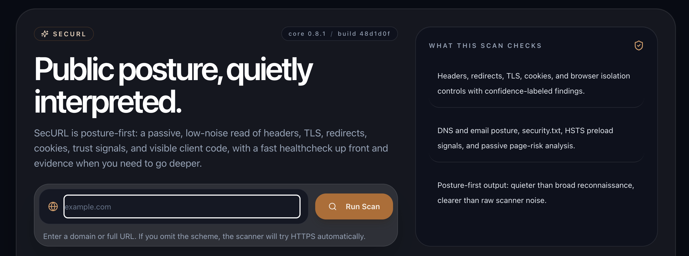
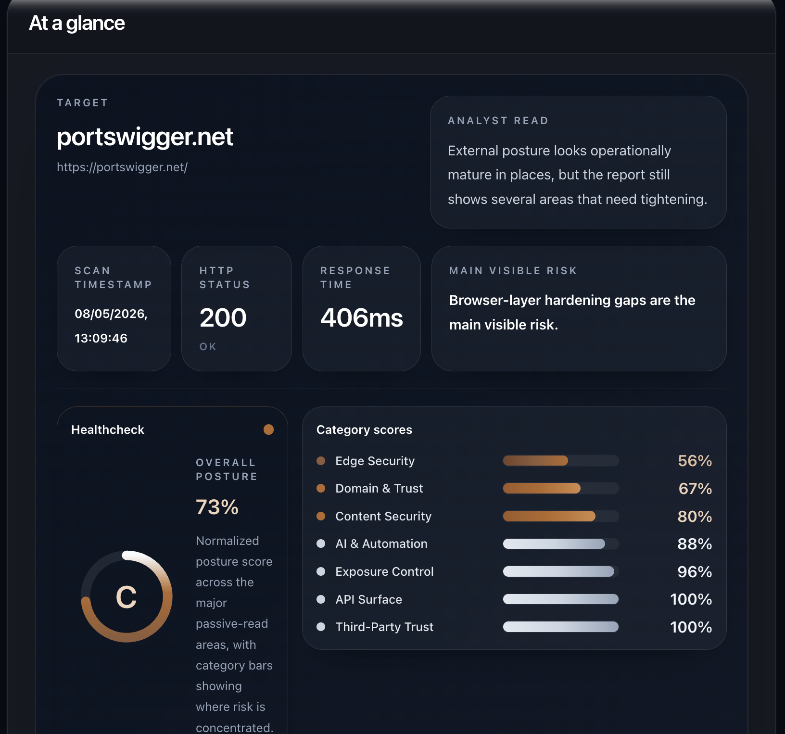
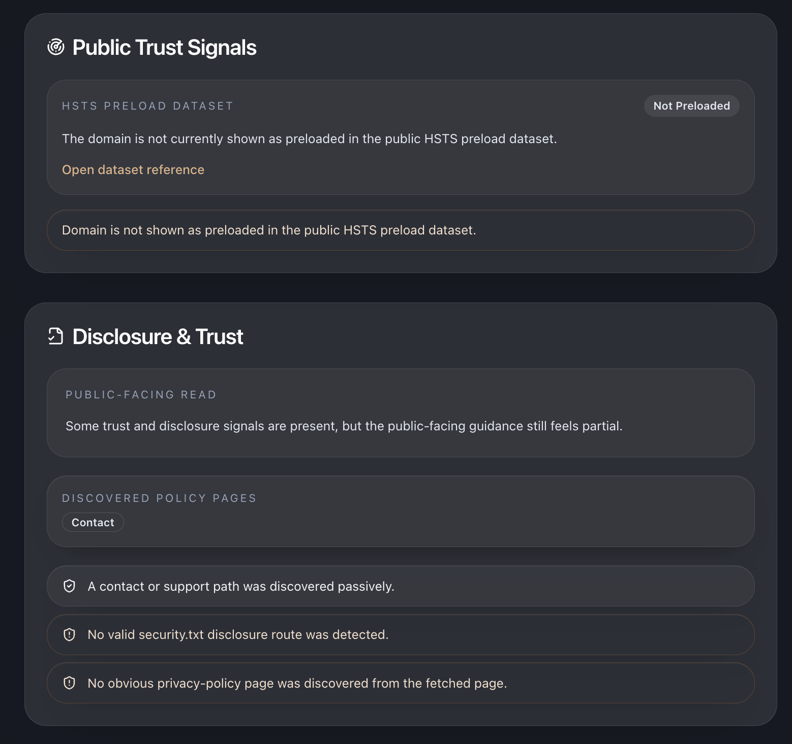

# SecURL

[](https://www.npmjs.com/package/securl)
[](https://www.npmjs.com/package/securl)
[](./LICENSE)
[](https://github.com/sponsors/ktbatterham)
[](https://x.com/ThisIsSecURL)
[](https://dev.to/thisissecurl)

**Public URL security posture, quietly interpreted.**

SecURL is a passive external security posture scanner for public URLs and web services. It reads what a browser, customer, auditor, or researcher can already see, then turns that evidence into clear findings, priority actions, and exportable reports.

It is built for low-noise review of headers, TLS, cookies, redirects, DNS/email posture, trust signals, third-party exposure, and public disclosure readiness.

SecURL is not a URL shortener. It assesses the external security posture of URLs you choose to scan.

<p>
  <a href="https://securl.online"><strong>Visit the SecURL site</strong></a>
  ·
  <a href="https://app.securl.online"><strong>Run a live scan</strong></a>
  ·
  <a href="https://apps.apple.com/app/securl/id6774322464"><strong>Download the iOS app</strong></a>
  ·
  <a href="https://www.npmjs.com/package/securl"><strong>Use the npm package</strong></a>
  ·
  <a href="https://x.com/ThisIsSecURL"><strong>Follow @ThisIsSecURL</strong></a>
  ·
  <a href="https://dev.to/thisissecurl"><strong>Read the Dev.to posts</strong></a>
  ·
  <a href="https://github.com/sponsors/ktbatterham"><strong>Support the project</strong></a>
</p>

## Try It

Use the hosted scanner if you want the quickest feel for the product:

- [securl.online](https://securl.online) — product and landing page
- [app.securl.online](https://app.securl.online) — live scanner and report workspace
- [SecURL on the App Store](https://apps.apple.com/app/securl/id6774322464) — iOS companion app
- [`securl`](https://www.npmjs.com/package/securl) — reusable CLI and Node engine

Follow product notes and practical posture write-ups at [@ThisIsSecURL on X](https://x.com/ThisIsSecURL) and [Dev.to/thisissecurl](https://dev.to/thisissecurl).

Or run the engine directly:

```sh
npx securl scan example.com
```

## Why SecURL

- Passive-first posture review without broad reconnaissance noise
- Clear analyst summaries and priority actions
- Browser-facing hardening checks across headers, redirects, TLS, cookies, and trust signals
- Quiet comparison over time with drift and history views
- Premium PDF, Markdown, and JSON outputs for stakeholder-friendly reporting

The short version:

- Shodan finds things.
- SecURL interprets them quietly.

## Screenshots

### Landing experience



### At-a-glance reporting



### Trust and disclosure detail



## What it checks

- Response headers such as HSTS, CSP, X-Frame-Options, X-Content-Type-Options, Referrer-Policy, Permissions-Policy, COOP, and CORP
- Redirect chains, TLS certificate posture, protocol and cipher details
- Cookie flags including `Secure`, `HttpOnly`, and `SameSite`
- Public trust and disclosure signals including `security.txt`, HSTS preload, and policy-page discovery
- Domain and email posture such as MX, SPF, DMARC, CAA, MTA-STS, TLS-RPT, and BIMI (DNS)
- Passive HTML signals including forms, third-party assets, missing SRI, inline scripts/styles, and light exposure clues
- Technology, provider, and AI-surface hints with conservative scoring
- Infrastructure inference for cloud, CDN, edge, PaaS, and hosting providers (Cloudflare, Railway, Render, Fly.io, Hostinger, Bunny.net, OVH, Hetzner, and others)
- Analytics and session-replay vendor detection (Google Analytics, Plausible, Matomo, Segment, Mixpanel, Amplitude, Heap, New Relic, Datadog, Hotjar, LogRocket, and others)

## Quick start

### Live app

Open [app.securl.online](https://app.securl.online) and scan a public target. For the product overview first, start at [securl.online](https://securl.online).

Prefer mobile? Install [SecURL on the App Store](https://apps.apple.com/app/securl/id6774322464).

### CLI

```sh
npx securl scan example.com
npx securl scan example.com --format markdown --output report.md
npx securl compare current-report.json previous-report.json
```

Global install:

```sh
npm install -g securl
securl scan example.com
```

### Local development

```sh
npm install
npm run dev
```

That starts:

- frontend on `http://localhost:8080`
- API on `http://127.0.0.1:8787`

### Production build

```sh
npm run ship
```

`npm run ship` runs `build:hostinger` (sets `VITE_API_BASE_URL` to the production API, then builds) followed by `verify` (`scripts/verify-build.mjs`). Use this for every production deployment — `npm run build` alone does not set the production API URL.

To deploy the static frontend to Hostinger over SSH, run a dry-run first:

```sh
npm run deploy:hostinger
```

If the dry-run looks right, deploy live:

```sh
npm run deploy:hostinger:live
```

The live deploy creates a remote backup, syncs `dist/` to `/home/u765511792/domains/app.securl.online/public_html/`, and smoke-checks [app.securl.online](https://app.securl.online). Railway remains backend/API-only.

### Shareable report links

Completed scans are available at `/report/:scanId` via the public `GET /api/scans/:id/share` endpoint. No auth token is required to view a shared link.

## Architecture

SecURL now has a clean split between:

- static frontend client
- Node backend API
- reusable SecURL package in [`packages/core`](packages/core)

That makes it much easier to:

- host the frontend separately from the backend
- support the hosted web app, iOS companion, CLI, and future clients from the same backend/API shape
- keep the scanner logic reusable in CLI and service contexts

## Roadmap

### Near term

- Tighten the premium PDF export into a cleaner executive deliverable
- Deepen monitoring detail and history views on top of the new backend resources
- Continue improving report clarity, remediation language, and visual maturity

### Product direction

- Keep the live scan and technical outputs strong and easy to try
- Define clearer boundaries between free workflow value and premium workflow value
- Treat premium reporting, recurring monitoring, and richer history as the most likely commercial foundations
- Explore shared/team views, API access, and mobile companion access after the service model is stable

### Not yet

- No public pricing or paywall yet
- No commitment to a final commercial package until the premium experience is clearly strong enough to justify it

## Support SecURL

SecURL is built as a FOSS-first security tool. If it helps your work, you can support ongoing development through [GitHub Sponsors](https://github.com/sponsors/ktbatterham).

Sponsorship helps fund continued work on the passive analysis engine, hosted scanner, reporting polish, and the open npm package. The scanner remains usable without sponsorship; support is simply a way to help the project keep moving.

## Package status

- Latest published package: `securl@1.5.1`
- Previous package name: `@ktbatterham/external-posture-core` is deprecated in favour of `securl`
- npm tag: `latest`
- Package signal check: `npm run package:signals`
- Core release checklist: [`packages/core/RELEASING.md`](packages/core/RELEASING.md)

## Docs

For the deeper operational and architecture material, go straight to:

- [Architecture view (C4)](docs/ARCHITECTURE-C4.md)
- [Backend API split-hosting notes](docs/BACKEND-API.md)
- [Public deploy checklist](docs/PUBLIC-DEPLOY-CHECKLIST.md)
- [iOS-capable backend notes](docs/IOS-CAPABLE-BACKEND.md)
- [Abuse and alerting notes](docs/ABUSE-ALERTING.md)
- [Package signal tracking](docs/PACKAGE-SIGNALS.md)
- [Reverse proxy verification](docs/REVERSE-PROXY-VERIFICATION.md)
- [OWASP/MITRE self-review](docs/OWASP-MITRE-SELF-REVIEW.md)

## Safety

Use this against systems you own or are authorized to assess.

SecURL is passive-first and intentionally conservative, but it is still a real external review tool. It cannot prove a target is secure, and it does not replace a penetration test, authenticated review, or broader security program.
