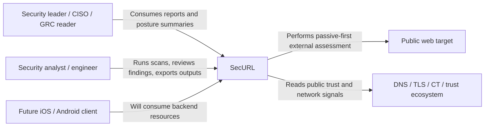
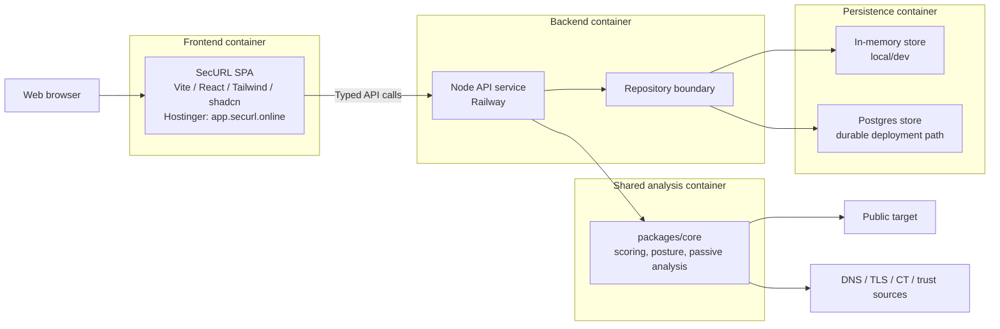
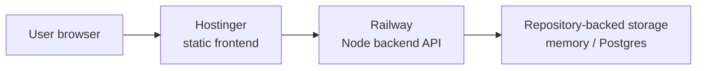

# SecURL Architecture (C4)

This document gives a current architecture view of SecURL using a lightweight C4-style structure:

- system context
- container view
- key responsibilities
- important boundaries

It is intended to describe the application as it exists now, not an idealized future state.

## System Context

SecURL is an external security posture product for public web targets. It gives users a passive-first read of browser hardening, trust signals, domain posture, exposed surface, and public disclosure readiness, then turns that into reportable output.

### People and external actors

- **Security leader / CISO / GRC reader**
  - consumes the executive-facing report output
- **Security analyst / engineer**
  - runs scans, reviews detailed findings, and uses technical outputs
- **Future mobile client**
  - will consume the same backend service model as the web client
- **Public target website**
  - the system being scanned
- **DNS / trust / certificate ecosystem**
  - upstream data sources indirectly consulted during analysis

### System context diagram

## Container View

SecURL is now split into four meaningful containers:

- static frontend client
- backend API service
- shared analysis core
- persistence layer

### Container diagram

## Container Responsibilities

### 1. Frontend SPA

Primary location:

- [src](../src)

Main responsibilities:

- collect scan input from the user
- call backend scan and monitoring resources
- render the reporting workspace
- render monitoring views and history summaries
- trigger exports

Important notes:

- the frontend is now intentionally thinner than before
- it can target a separate backend with `VITE_API_BASE_URL`
- it is deployed as a static site on Hostinger at [app.securl.online](https://app.securl.online)

### 2. Backend API Service

Primary location:

- [server](../server)

Main responsibilities:

- expose scan resources
- expose monitoring target resources
- own lifecycle transitions and event history
- enforce request scoping
- provide a stable service boundary for web and future mobile clients

Current important resources:

- `POST /api/scans`
- `GET /api/scans`
- `GET /api/scans?url=...`
- `GET /api/scans/:id`
- `GET /api/scans/:id/summary`
- `GET /api/scans/:id/findings`
- `GET /api/scans/:id/evidence`
- `GET /api/scans/:id/history`
- `GET /api/scans/:id/comparison`
- `GET /api/scans/:id/share` (public — no auth required)
- `POST /api/monitoring-targets`
- `GET /api/monitoring-targets`
- `GET /api/monitoring-targets/:id`
- `POST /api/monitoring-targets/:id/run`
- `DELETE /api/monitoring-targets/:id`

### 3. Shared Analysis Core

Primary location:

- [packages/core](../packages/core)

Main responsibilities:

- passive-first assessment logic
- posture scoring
- category scoring
- trust and surface interpretation
- CLI support
- shared semantics between frontend, backend, and future clients

This is the part that prevents the product from drifting into:

- one scoring model in the UI
- another in the backend
- and another in future mobile work

### 4. Persistence Layer

Primary location:

- [server/scanRepository.mjs](../server/scanRepository.mjs)

Main responsibilities:

- abstract storage away from the HTTP layer
- support in-memory local development
- support Postgres-backed durability
- persist scan summaries, results, lifecycle events, and monitoring targets

This is the main durability seam that made backend-owned monitoring possible.

## Deployment View

Current practical deployment split:

- **Frontend**
  - Hostinger
  - static files only
  - public URL: [app.securl.online](https://app.securl.online)

- **Backend**
  - Railway
  - Node API runtime
  - currently the live service execution layer

### Deployment diagram

## Key Architectural Boundaries

### Presentation boundary

The frontend should:

- render
- orchestrate
- export

It should not be the long-term source of truth for:

- monitoring targets
- history
- cross-device state

### Service boundary

The backend should own:

- scans
- lifecycle transitions
- monitoring targets
- target history
- comparison/diff state

This is the key boundary that makes future Android and iOS companions realistic.

### Analysis boundary

The shared core should own:

- posture logic
- score computation
- interpretation rules
- passive-read semantics

That keeps the product consistent regardless of delivery channel.

### Storage boundary

The repository layer should shield the service from storage choice.

That keeps it possible to:

- run cheaply in local dev
- evolve toward durable Postgres-backed deployments
- revisit queueing or worker models later without rewriting the HTTP contract

## Current Strengths

The architecture is now materially stronger in a few important ways:

- frontend and backend are properly separable
- monitoring targets are backend-owned
- target history and comparison are backend-owned
- the service shape is now suitable for future mobile reuse
- the analysis core is reusable across web, backend, CLI, and export flows

## Current Transitional Areas

Some parts are still transitional rather than final:

- auth still uses the `X-Scan-Owner` model rather than real user identity
- PDF export is still browser-print-driven rather than a dedicated server-side render pipeline
- Postgres is structurally supported, but the production durability story can still deepen
- some UX/reporting behavior is richer than the service contract beneath it

## Recommended Next Architecture Steps

From here, the most sensible architecture moves are:

1. real user auth and ownership model
2. durable Postgres-backed production persistence by default
3. richer monitoring detail UI using the backend detail endpoint
4. dedicated PDF render path once the premium report structure stabilizes
5. mobile clients consuming the same monitoring and scan resources

## Related Docs

- [Backend API split-hosting notes](BACKEND-API.md)
- [iOS-capable backend notes](IOS-CAPABLE-BACKEND.md)
- [Public deploy checklist](PUBLIC-DEPLOY-CHECKLIST.md)
